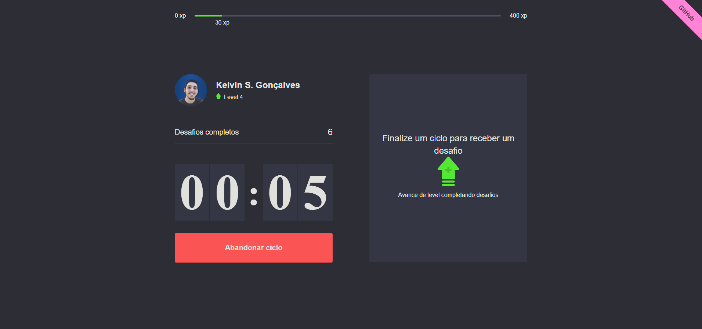
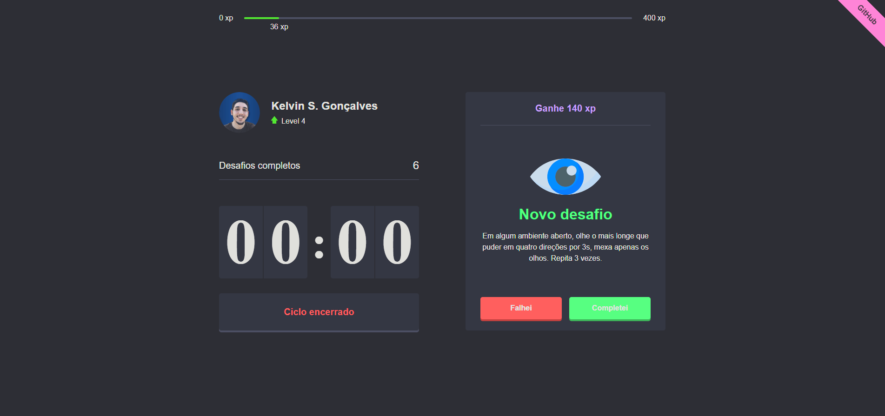
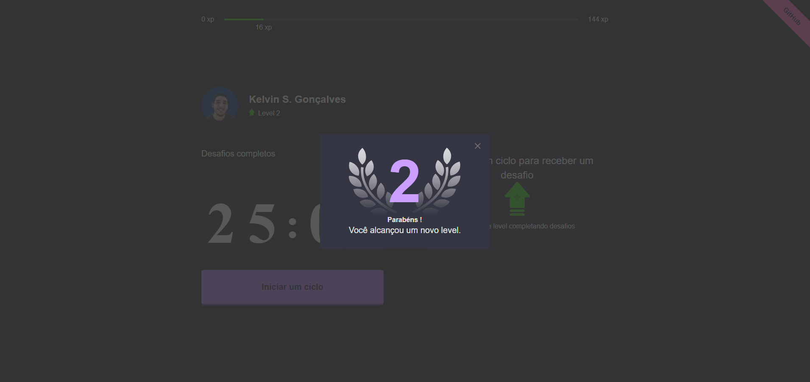

# Moveit

## Descrição
O Moveit é um aplicativo inspirado no método Pomodoro, mas com uma abordagem gamificada. Ele desafia os usuários com exercícios simples de alongamento a cada 25 minutos, ajudando a manter a produtividade durante o trabalho e os estudos. Este projeto foi desenvolvido durante meu aprendizado, com a ajuda da equipe da Rocketseat.

## Instalação
Para utilizar o Moveit, você pode acessar o projeto online [clicando aqui](https://moveit-next-alpha-tan.vercel.app/) ou executá-lo em sua própria máquina utilizando o Node.js. Certifique-se de ter o Node.js instalado e, em seguida, execute o seguinte comando:

```bash
npm run dev
```

## Como usar
O Moveit pode ser usado durante suas sessões diárias de estudo, trabalho ou qualquer atividade que você realize na frente do computador. O aplicativo sinaliza o momento para fazer pausas e realizar alongamentos, ajudando a manter uma rotina saudável.

## Tecnologias Utilizadas
- **Next.js**: Framework React para construção de interfaces web.
- **React**: Biblioteca JavaScript para construção de interfaces de usuário.
- **TypeScript**: Linguagem de programação para desenvolvimento de aplicações web.
- **ESLint**: Ferramenta de análise estática de código para identificar e relatar padrões problemáticos no código JavaScript.
- **JS-Cookie**: Para salvar os dados do usuário nos cookies, garantindo uma experiência personalizada.

## Capturas de Tela





